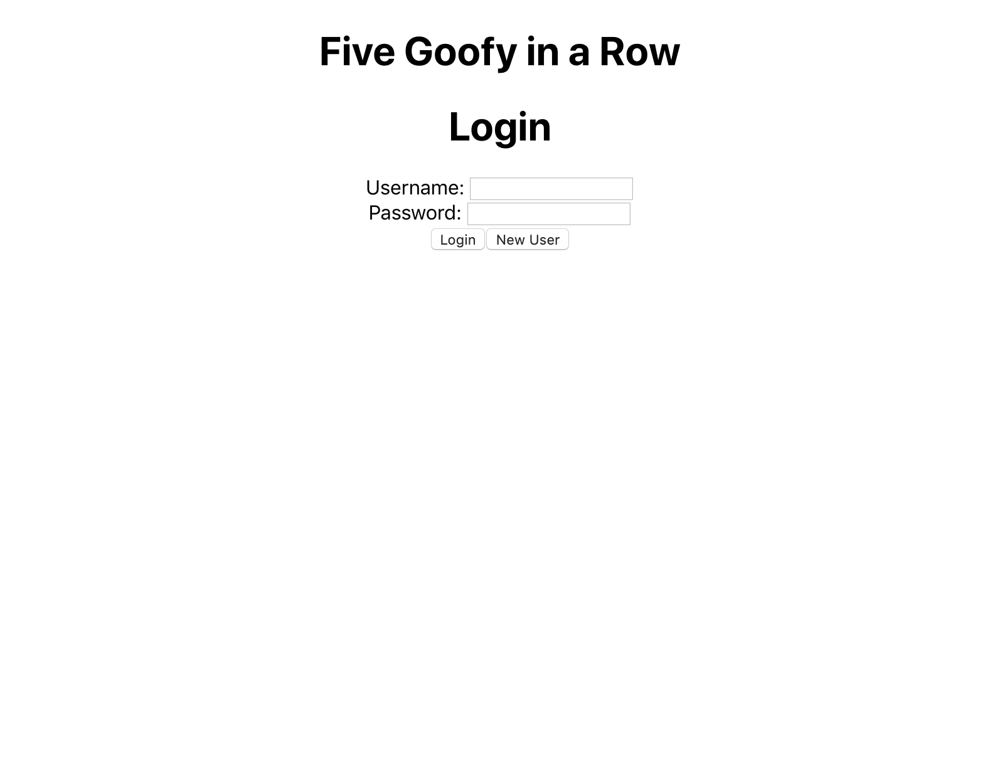
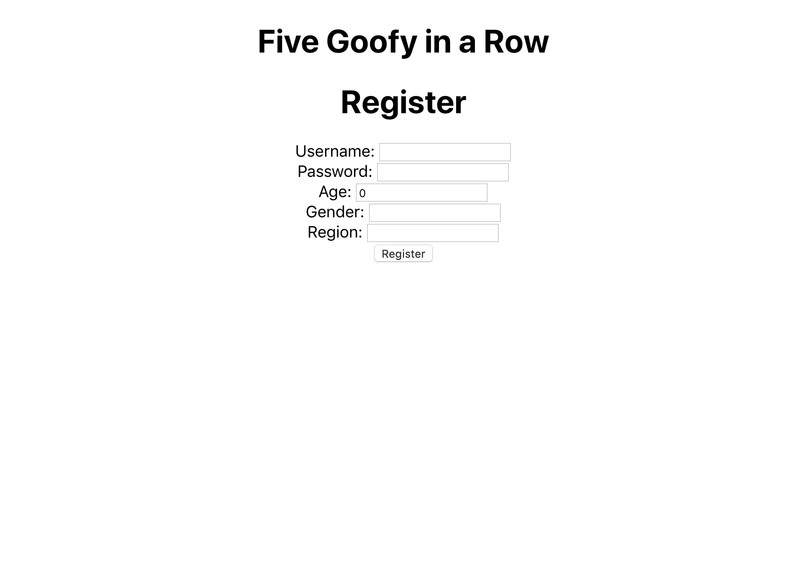
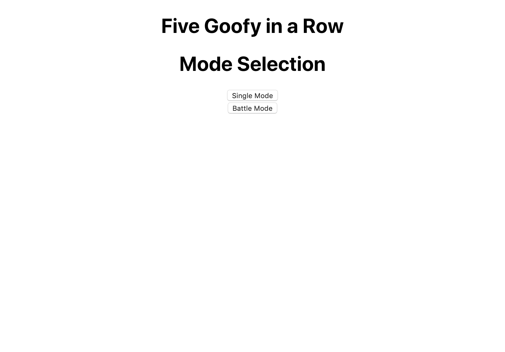
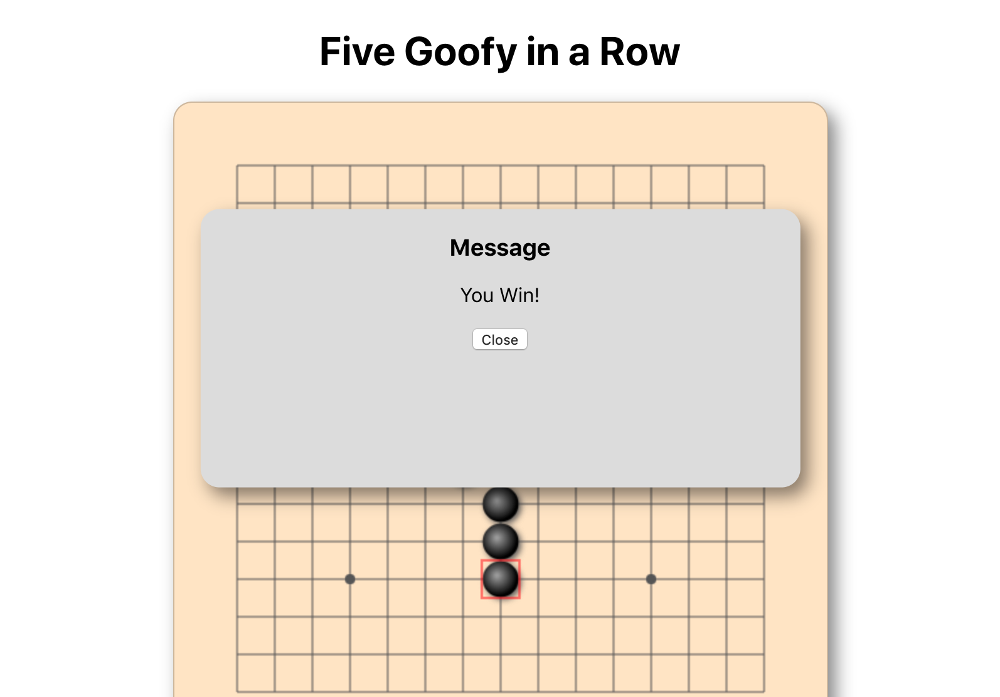
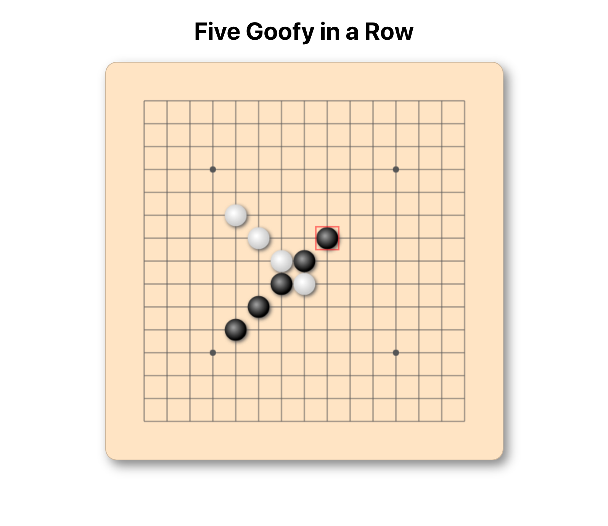

# Project report: including ui wireframe, design pattern implemented and explaination. Link images as needed

## Design Pattern Used:
1. State Pattern:  Game state change btw player1 and player2, and change to GameEnd state in the end. -implemented by Gaochao
2. Facotry Pattern:  Factory produce BlackPiece and WhitePiece for player to put in game board. -implemented by
3. Abstract Factory Pattern: use Abstract Factory to get BlackPieceFacotry and WhitePieceFactory. -implemented by Xiaoting Jin
4. Decorator: Respond objects such as status code, user information, and player's move can be added in runtime. -implemented by 
5. Builder: build UserInfo object with manay field, such as username, password, region, gender, age, wins, loses. -implemented by Yuxiang
6. Object Pool: reuse the ended game object without instantiate a new object. Save time and memory when createing new object. -implemented by

## UI wireframe

## UML Diagram

### Use Case Diagram

### Class Diagram

