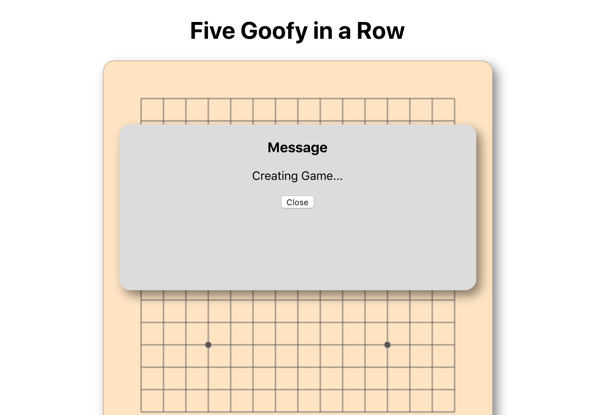

# Project Report

## Design Pattern Used:
1. State Pattern:  Game state change btw player1 and player2, and change to GameEnd state in the end. -implemented by Gaochao
2. Facotry Pattern:  Factory produce BlackPiece and WhitePiece for player to put in game board. -implemented by Gaochao
3. Abstract Factory Pattern: use Abstract Factory to get BlackPieceFacotry and WhitePieceFactory. -implemented by Xiaoting Jin
4. Decorator Pattern: Respond objects such as status code, user information, and player's move can be added in runtime, so it is easier to update and maintenance in future. -implemented by Chikei Loi
5. Builder Pattern: build UserInfo object with manay field, such as username, password, region, gender, age, wins, loses. -implemented by Yuxiang
6. Strategy Pattern: Strategy design pattern is one of the behavioral design pattern. Strategy pattern is used when we have multiple algorithm for a specific task and client decides the actual implementation to be used at runtime. Here, Strategy Pattern allows us to easily set what level needs to be implemented at run time. -implemented by Tianyu Cao

## UI wireframe

## UML Diagram

### Use Case Diagram

### Class Diagram

### Activity Diagram

### Sequence Diagram

